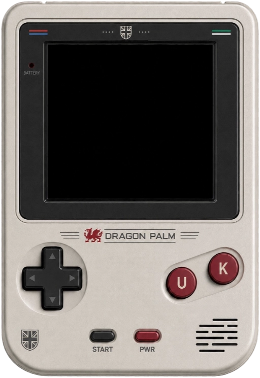

# Dragon Palm


**Dragon Palm** is a fantasy 8-bit handheld console that runs tiny (8KB) raw binary cartridges in your browser. It has a 128x128 packed-pixel screen, a deliberately severe 11-opcode CPU, clickable handheld controls, drag-and-drop carts, a boot chime, and just enough hardware awkwardness to make every game feel earned. The fantasy hardware combines a different era with modern experience. I think it's decent enough, and I hope you do too.



## How to Play

Open [index.html](index.html) in a browser, then drag a `.dgc` cartridge onto the console screen.

Try the included carts:

| Cart | File | Controls |
| --- | --- | --- |
| **Adder** | [carts/adder.dgc](carts/adder.dgc) | D-pad changes direction. |
| **Magic Screen** | [carts/magic-screen.dgc](carts/magic-screen.dgc) | D-pad draws, `U` changes colour up, `K` changes colour down. |
| **Dragon Tennis** | [carts/tennis.dgc](carts/tennis.dgc) | Up and Down move the paddle. |

You can use the on-screen buttons or keyboard controls:

| Control | Keyboard |
| --- | --- |
| D-pad | Arrow keys or `WASD` |
| U button | `U` |
| K button | `K` |
| Start | Space |
| Pwr | Enter |

## Make Your Own Games

Dragon Palm cartridges are raw 8192-byte `.dgc` files loaded at `$0000`. Source carts are written in the tiny Dragon Palm assembly language and assembled with Node.js:

```sh
node tools/assembler.js carts/magic-screen.asm carts/magic-screen.dgc
```

Read the developer kit:

- [Hardware Guide](docs/hardware.md)
- [Assembly Language Reference](docs/language.md)
- [Cartridge Format](docs/cartridge.md)

## Fantasy Hardware Specification

- 16 KB single flat memory array
- 8 KB writable program space
- 8 KB packed 4-bit VRAM
- 128x128 display with 16 colours
- `A`, `X`, and `Y` registers
- 11 opcodes
- No stack, no indirect addressing, no mercy?

## Licence

MIT. See [LICENSE](LICENSE).

